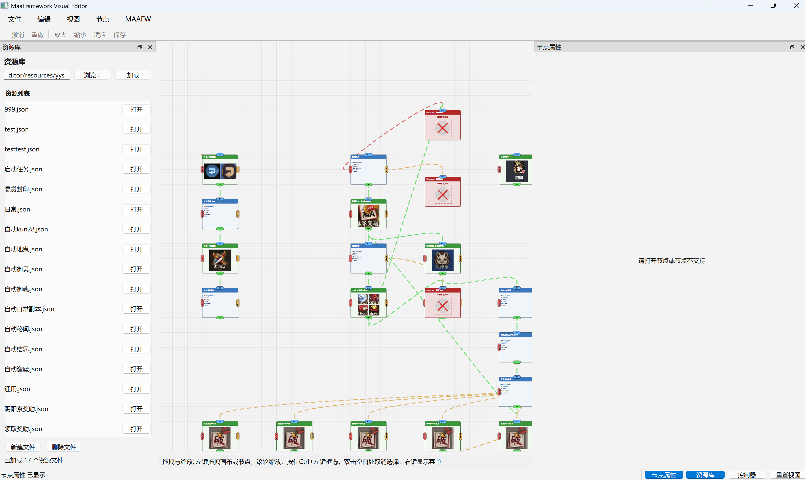
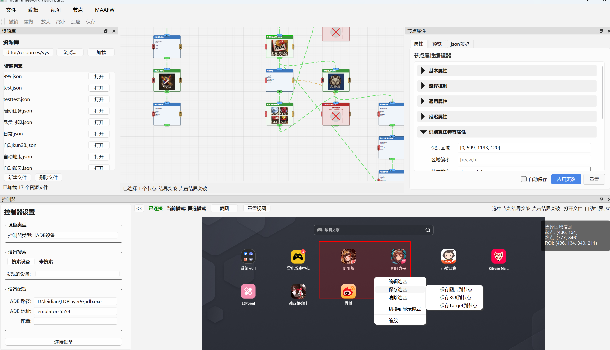

# MaaFramework Visual Editor

**MaaFramework Visual Editor** 是基于 [MaaFramework (MAAFW)] 的可视化节点编辑器，用于图形化构建和编辑自动化任务流。它采用 PySide6 开发，提供灵活的节点管理、属性编辑、资源配置以及控制器管理视图。

---

## 🎯 项目功能

- 可视化构建任务节点流程
- 多视图协同操作（节点属性、控制器、资源库）
- 支持撤销/重做、复制/粘贴、剪切/删除等常规操作
- 节点对齐到网格、全选等批量管理功能
- 状态栏 + 工具栏 + 菜单栏友好交互
- 状态持久化（自动保存窗口和画布布局）
- 支持资源文件导入与节点联动
- 支持直接从控制器中添加识别图片到节点

## 🚀 启动方式

1. **克隆仓库：**  


```bash
git clone https://github.com/your-repo/maafw-visual-editor.git
cd maafw-visual-editor
```

2. **安装依赖：**

```bash
pip install -r requirements.txt
```

3. **运行主程序：**

```bash
python main.py
```

---


## 使用预览





---

## 📌 注意事项
* 请使用 UTF-8 编码保存脚本
* 推荐使用 Python 3.8+

---

## 📃 许可协议

本项目基于 MIT 协议发布，详情见 [LICENSE](./LICENSE) 文件。

---

## 🤝 贡献指南

欢迎提交 PR、优化功能或提出建议！


